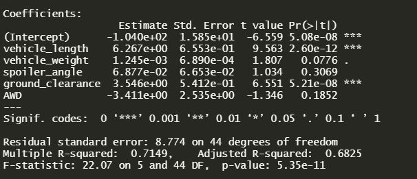
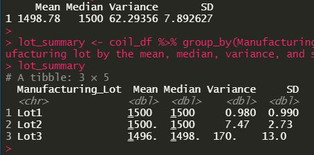
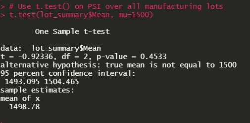
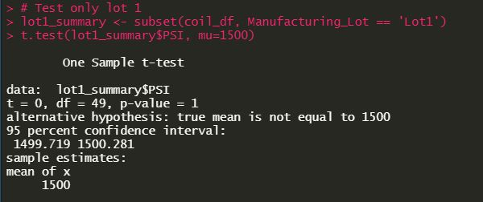
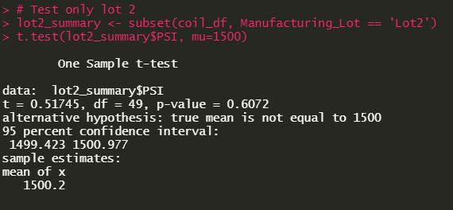
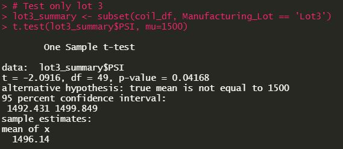

# MechaCar Statistical Analysis

## Overview
* This analysis investigates MechaCar's car production data for potentially useful insights. We aim to isolate the particular variables most predictive of miles per gallon performance. 

## Linear Regression to Predict MPG
* Spoiler weight, vehicle angle and AWD (all-wheel drive) contributed to non-random variances in the model. Ground clearance and vehicle length were the two most significant variables. 

* The slope of the linear model can be considered not zero as indicated by the extremely low p-value of the F-statistic.

* This model's R^2 value is 0.71, meaning 71% of the variations in miles-per-gallon between cars can be attributed to differences in vehicle lengths, spoiler angles, vehicle weights and ground clearance. An R^2 of 0.71 is considered a fairly strong predictive performance for this model.  

## Summary Statistics on Suspension Coils
* Design limitations on suspension coils required that the variances in the coils' strength _not exceed_ 100 pounds per square inch. This analysis found the variance across _all_ suspension coils to be 62.3 pounds per square inch, well within the stated limitation _overall_. However, individual analysis of each lot reveals that in fact _Lot 3's_ suspension coils vary too greatly at a variance of _170 psi_ while Lots 1 and 2 are well within our limitations at 0.98 psi and 7.47 psi respectively. 

## T-Tests on Suspension Coils
* The t-test on PSI over _all lots_ returns a p-value of 0.45, therefore we fail to reject the null hypothesis when α = 0.05.

* The t-test on PSI for _only Lot 1_ returns a p-value of 1.0, therefore we fail to reject the null hypothesis when α = 0.05.

* The t-test on PSI for _only Lot 2_ returns a p-value of 0.61, therefore we fail to reject the null hypothesis when α = 0.05.

* The t-test on PSI for _only Lot 3_ returns a p-value of 0.0042, therefore we may reject the null-hypothesis in favor of the alternative hypothesis that Lot 3's true mean PSI is not equal to 1500. 

## Designing a Study: MechaCar vs. Competition
* This section will explore possibilities for follow-up studies comparing MechaCar's vehicles to its competitors'. 

* To compare MechaCar's vehicles to their competition, a number of different variables could be of interest. For example, consumers would no doubt be interested in how fuel efficiency is related to maintenance costs. Does maintenance cost increase or decrease with fuel efficiency, or is there perhaps no significant relationship at all?  
A study investigating this relationship could look roughly like so:

        * Independent Variable: Fuel Efficiency (miles-per-gallon)
        * Dependent Variable: Maintenance Cost
        * H₀ (null): There is no statistically significant relationship (α = 0.05) between Fuel Efficiency and Maintenance Cost.
        * Hₐ (alternative): There is some statistically significant relationship (α = 0.05) between Fuel Efficiency and Maintenance Cost.
        * A two-tailed t-test would be needed to determine if there is some relationship between Fuel Efficiency and Maintenance Cost. To ask whether that potentially-significant difference is positive or negative, a one-tailed t-test would be necessary. 

